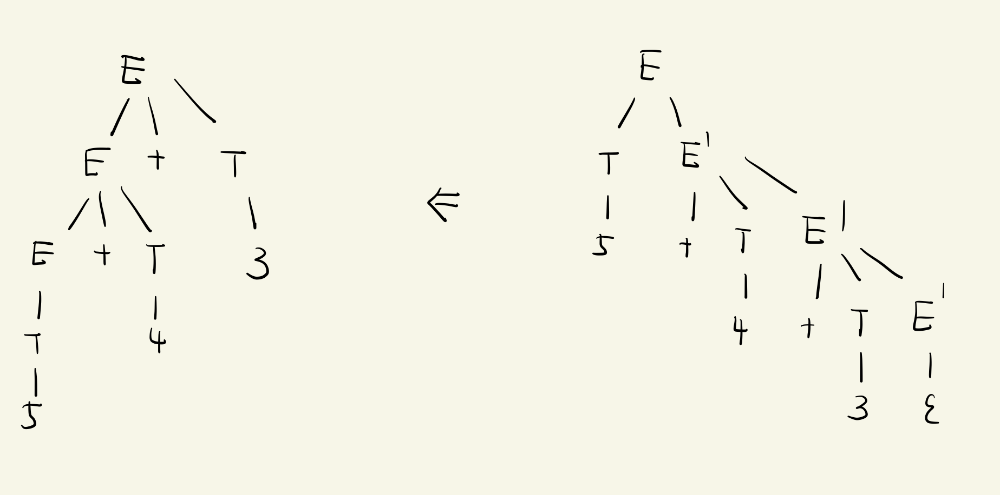
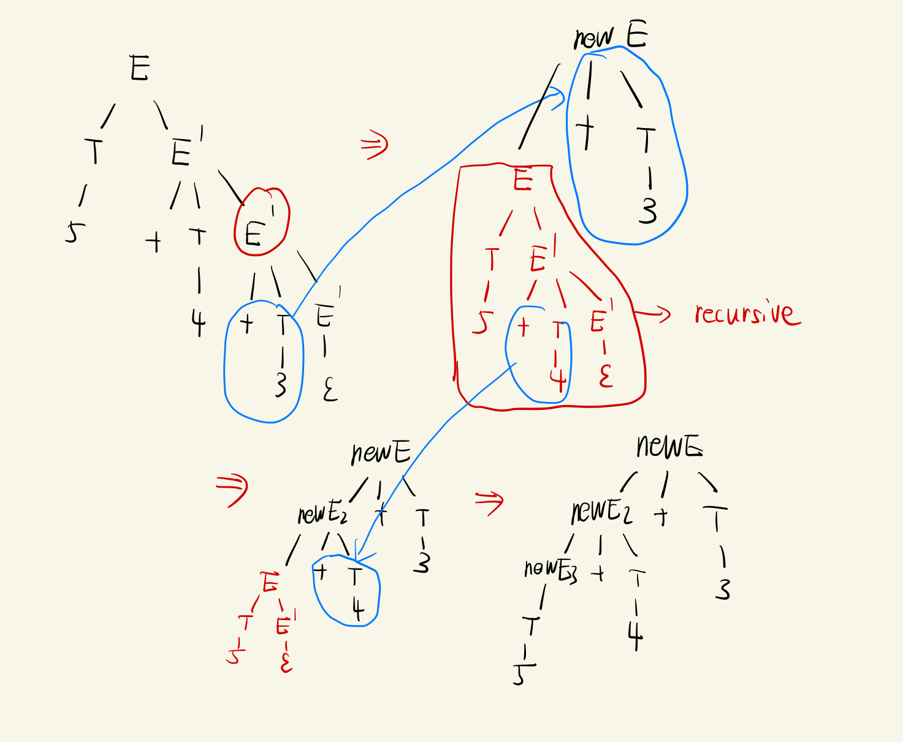

### 消除左递归
立即左递归消除算法比较简单, 借助下面的方法可以将立即左递归转化为右递归

形如: 
$$
A\rightarrow A\alpha_1|A\alpha_2|\cdots|A\alpha_m|\beta_1|\beta_2|\cdots|\beta_n
$$
其中 $\beta_i$ 都不以 $A$ 开头。然后，将这些 $A$ 的产生式替换为
$$
A\rightarrow\beta_1A'|\beta_2A'|\cdots|\beta_nA' \\
A'\rightarrow \alpha_1A'|\alpha_2A'|\cdots|\alpha_mA'|\epsilon
$$
通过新的产生式我们可以通过Parser 得到一颗AST，但是这不是我们想要的AST，我们希望还是原来产生式生成的AST，我们可以对他进行还原

### 还原AST

我们首先给出一个具体的例子来分析比如我们熟悉的表达式例子
$$
\begin{aligned}
E \rightarrow & E + T\\
|&\;\;T; \\
T \rightarrow & T * F\\
|&\;\; F; \\
F \rightarrow & int\\
|&\;\; (E); \\
\end{aligned}
$$


可以转换为 
$$
\begin{aligned}
E &\rightarrow  TE'\\
E' &\rightarrow  +TE'|\epsilon\\
T &\rightarrow  FT'\\
T' &\rightarrow  *FT'|\epsilon\\
F &\rightarrow (E)|id
\end{aligned}
$$
对于 $5+4+3$ 我们可以生成如下的AST

利用如下构造方法可以从右边的树（消除左递归后产生式语法分析生成的AST) 构造出左边的树（原式左递归生成的AST)

1. 对子树 ($A$ ) 的左右边节点搜索，直到遇到 $\epsilon$ 节点 $v_1$ ，$v_1$ 的爷节点$(A'_1)$ 一定对应某个 $\alpha_i$ 或者 $A$ 本身

   * 如果 $v_1$ 的祖父节点 $A'_1$ 是 $A$ 本身，那么可以去掉 $v_1$ 的右孩子，得到原式中  $A\rightarrow \beta_i$ 的 AST
   * 反之，$A_1'$ 一定对应原式中某个 $\alpha_i$ ，我们创建一个新的 $A$ 节点， $A'_1$ 的子节点去掉最右节点按顺序填入 新$A$ 节点中作为孩子节点，将 $A'_1$ 的孩子置为 $\epsilon$ ，递归处理原来的 $A$ 节点，作为新 $A$ 节点最左孩子。

   伪代码如下

   ```
   recovery_ast(A)
   	A' = A
   	while A'->right->right != epsilon
   		A' = A'->right
   	if A' == A
   		remove A->right
   		return A
   	remove A'->right
   	newA.children = A'.children
   	A'.children = epsilon
   	newA->push_left(recovery_ast(A))
   	return newA
   ```

   对于表达式的例子，算法执行过程如下

   

   

